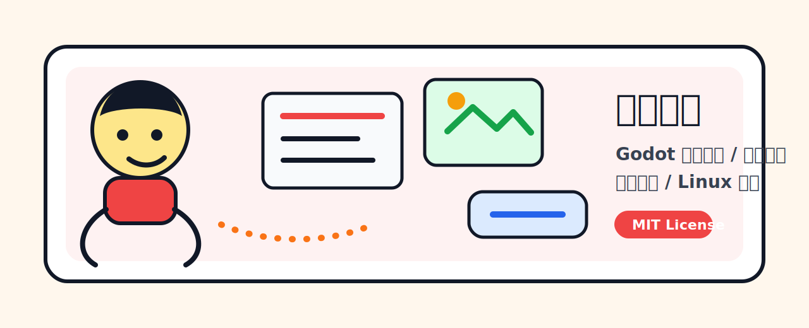
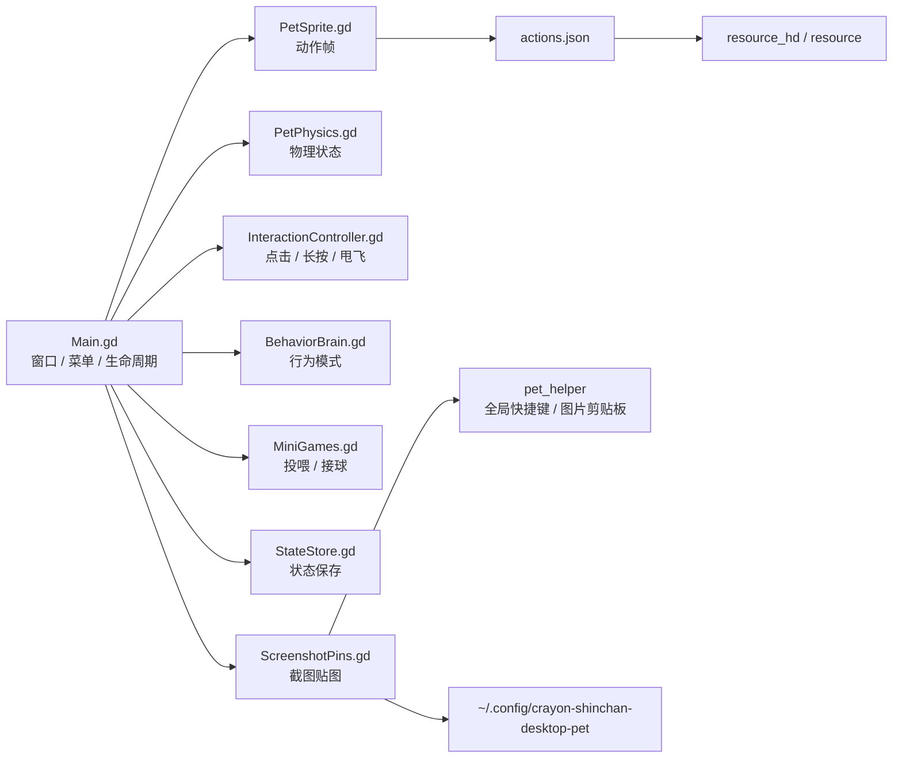

<p align="center">
  
</p>

# 蜡笔小新桌宠

Godot 4 驱动的本地透明桌宠：支持长按抱起、甩飞、重力落地、贴边偷看、主动行为、小游戏和跨平台截图贴图。

<p>
  <a href="https://github.com/MzKyle/Crayon-Shinchan-Desktop-Pat"></a>
  
  
  
  
</p>

功能特性 · 系统架构 · 快速开始 · 打包发布 · [完整文档](docs/)

## 功能特性

- 透明、置顶、无边框 Godot 桌宠窗口，支持安全窗口模式兜底
- 长按抱起、弹簧跟随、快速甩飞、重力落地、墙面反弹和贴边吸附
- 拖到屏幕边缘释放后进入贴边偷看，点击或拖拽即可唤回
- 安静、活泼、捣乱三种行为模式，默认安静启动
- 右键菜单支持散步、投喂、睡觉、唤醒、接球挑战、显示大小、重力开关和退出
- 跨平台截图贴图：`F1` 区域截图并复制图片、`F3` 轮换贴图、`F4` 关闭当前贴图
- 心情、饥饿、体力、亲密度本地持久化
- `resource_hd/` 高清资源优先加载，缺失时回退到 `resource/`
- portable Godot runtime bundle 打包，也支持安装 export templates 后走 Godot export

## 系统架构



核心链路是：`Main.gd` 编排 Godot 窗口、动画、物理、输入和菜单；`PetPhysics.gd` 计算窗口坐标；`PetSprite.gd` 加载动作帧；截图贴图模块通过 Godot 子窗口和跨平台 helper 扩展桌面能力。

## 技术栈

| 层级 | 技术 | 用途 |
| --- | --- | --- |
| 桌面运行时 | Godot 4.6 | 透明窗口、2D 渲染、输入事件、子窗口 |
| 主逻辑 | GDScript | 桌宠状态、物理、行为、小游戏、截图贴图 |
| 工具脚本 | Python 3 / Bash | 资源生成、Godot 准备、跨平台 helper、打包 |
| 截图后端 | Godot `DisplayServer` / 平台剪贴板 helper | 区域截图、图片剪贴板和旧 Linux 工具兜底 |
| 文档 | docsify / Mermaid | 文档站、架构图和模块说明 |

## 项目结构

```text
.
├── docs/                  # docsify 项目文档
├── godot_pet/             # Godot 项目
│   ├── assets/actions.json
│   ├── scenes/Main.tscn
│   └── scripts/           # 桌宠核心 GDScript
├── resource/              # 原始动作帧
├── resource_hd/           # 高清动作帧
├── assets/                # 特效、小游戏、偷看和素材来源说明
├── scripts/               # 启动、生成、打包和跨平台 helper 脚本
├── packaging/             # Linux desktop entry 模板
└── requirements.txt
```

## 环境要求

- Windows、macOS 或 Linux 桌面环境
- Godot 4.6.x，或让 `scripts/setup_godot.sh` 自动下载 portable 版本
- Python 3.10+
- Linux 可选：`wl-copy` 或 `xclip`，用于把截图复制到图片剪贴板
- Linux 可选：KDE Spectacle 或 ImageMagick，用于 Godot 截图不可用时兜底
- 可选：Godot export templates，用于正式 export

## 快速开始

```bash
python3 scripts/setup_dev_environment.py
scripts/setup_godot.sh
python3 scripts/generate_godot_manifest.py
scripts/run_godot_pet.sh
```

如果透明窗口在当前桌面环境里显示异常：

```bash
CRAYON_PET_SAFE_WINDOW=1 scripts/run_godot_pet.sh
```

## 常用命令

```bash
python3 scripts/generate_godot_manifest.py
python3 scripts/generate_hd_assets.py --source resource --output resource_hd --scale 3 --force
scripts/run_godot_pet.sh
python3 scripts/build_portable.py --target linux
scripts/build_godot_linux.sh
scripts/install_desktop_entry.sh
```

## 使用说明

| 操作 | 效果 |
| --- | --- |
| 单击头部 | 摸摸头 |
| 单击身体 | 戳一戳 |
| 长按 350ms | 抱起并跟随鼠标 |
| 快速释放 | 甩飞并受重力影响 |
| 拖到屏幕边缘释放 | 进入贴边偷看 |
| 双击 | 开始接球挑战 |
| 滚轮 | 显示心情、饥饿、体力和亲密度 |
| 右键 | 打开动作、模式、截图贴图设置和退出菜单 |

截图贴图默认快捷键：

| 快捷键 | 效果 |
| --- | --- |
| `F1` | 区域截图，保存历史并复制到剪贴板 |
| `F3` | 按最近、上一次、上上次顺序贴图 |
| `F4` | 关闭当前贴图 |

## 打包发布

跨平台 portable zip：

```bash
python3 scripts/build_portable.py --target linux
python3 scripts/build_portable.py --target windows
python3 scripts/build_portable.py --target macos
```

本地通常只构建当前系统对应的 target；三平台产物由 GitHub Actions 在对应 runner 上构建。

Linux runtime bundle：

```bash
scripts/build_godot_linux.sh
```

Linux runtime 产物位于：

```text
dist/GodotShinchanPet/CrayonShinchanGodotPet
```

使用 Godot export：

```bash
scripts/setup_godot_export_templates.sh
scripts/build_godot_linux.sh --export
```

安装桌面入口：

```bash
scripts/install_desktop_entry.sh
```

## 数据与配置

运行时状态保存在：

```text
~/.config/crayon-shinchan-desktop-pet/state.json
```

截图贴图配置和历史保存在：

```text
~/.config/crayon-shinchan-desktop-pet/config.json
~/.config/crayon-shinchan-desktop-pet/screenshots/
```

行为模式不写入状态文件，每次启动都会回到安静模式。

## 文档

完整文档见 [docs/](docs/)。

本地预览：

```bash
cd docs
python3 -m http.server 4173 --bind 127.0.0.1
```

访问：

```text
http://127.0.0.1:4173/
```

## 常见问题

### 透明窗口异常怎么办？

先用安全窗口模式确认项目逻辑：

```bash
CRAYON_PET_SAFE_WINDOW=1 scripts/run_godot_pet.sh
```

### 全局快捷键不生效怎么办？

全局快捷键由 `scripts/pet_helper.py` 或打包后的 `scripts/pet_helper` 提供。Linux Wayland 下默认保留应用内快捷键兜底；macOS 首次使用可能需要在系统设置里授予辅助功能权限。也可以显式关闭全局快捷键：

```bash
CRAYON_PET_ENABLE_GLOBAL_HOTKEYS=0 scripts/run_godot_pet.sh
```

### 新动作资源不生效怎么办？

重新生成动作清单：

```bash
python3 scripts/generate_godot_manifest.py
```

## 贡献

欢迎提交 Issue 和 Pull Request。建议 PR 描述中包含问题背景、主要修改内容、本地验证方式；涉及 UI 或桌面交互时，请附截图或录屏。

## 许可

代码基于 [MIT License](LICENSE) 开源。角色相关素材属于粉丝项目素材，请仅在学习、研究和个人桌面使用场景中使用；第三方图标素材来源和授权见各目录下的 `NOTICE.md`。

## 致谢与参考

- [Godot Engine](https://godotengine.org/)
- [VPet](https://github.com/LorisYounger/VPet)
- [Shimeji-ee](https://github.com/gil/shimeji-ee)
- Google Noto Emoji
