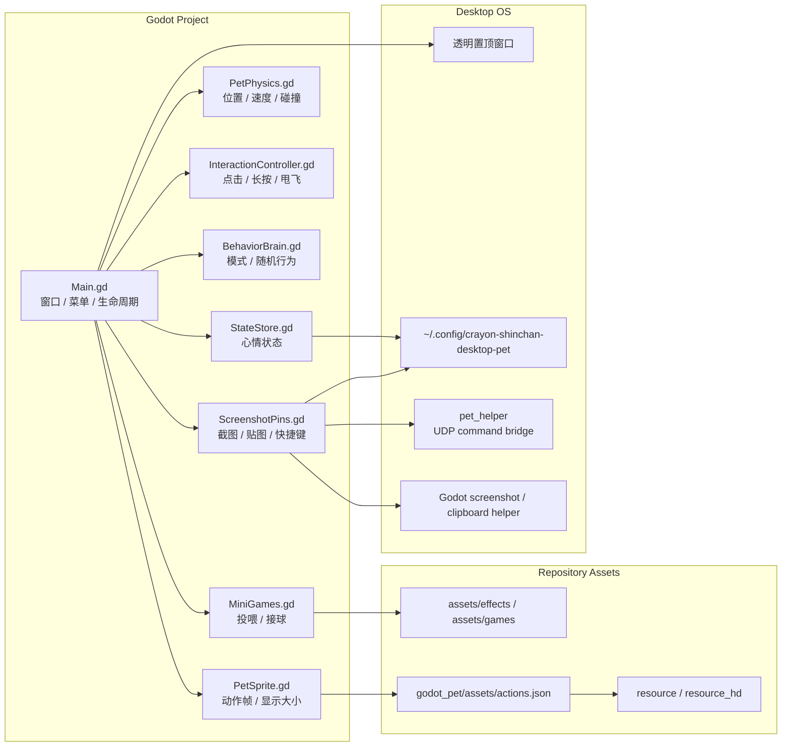

# 蜡笔小新桌宠
----
> Godot 4 驱动的透明桌面宠物，带物理互动、行为模式、小游戏、截图贴图和 Linux 打包流程。


## 项目简介

蜡笔小新桌宠是一个 Godot-only 的本地桌面宠物项目。应用运行后会创建透明、置顶、无边框窗口，让角色停留在桌面上，并通过物理模拟支持抱起、甩飞、重力落地、贴边行走和边缘偷看。

项目的重点不是单张静态贴图，而是把角色动画帧、透明窗口穿透、输入控制、状态存储、行为调度、小游戏和跨平台截图贴图组合成一个完整的桌面体验。Python 脚本只用于素材处理、动作清单生成、Godot 运行时准备和跨平台 helper。

## 核心功能

- **透明桌宠窗口** - 无边框、置顶、透明背景，并尽量只让角色可见区域接收鼠标事件
- **物理互动** - 长按抱起、弹簧跟随、按释放速度甩飞、重力落地、墙体反弹和贴边吸附
- **边缘偷看** - 把角色拖到屏幕边缘释放后，窗口缩小并只露出偷看的贴边图
- **行为模式** - 安静、活泼、捣乱三种模式，控制自动散步、贴边走和温和捣乱演出
- **小游戏** - 饭团投喂、接球挑战，并影响心情、饥饿、体力和亲密度
- **截图贴图** - Windows、macOS、Linux 下支持 `F1` 区域截图、`F3` 轮换贴图、`F4` 关闭当前贴图
- **素材管线** - 从 `resource/` 生成 `resource_hd/`，再生成 Godot 动作清单
- **Linux 打包** - 支持 portable Godot runtime bundle，也可安装 export templates 后走 Godot export

## 快速导航

- [环境依赖与准备](guide/prerequisites.md)
- [开发运行](guide/run-app.md)
- [安装与打包](guide/package-install.md)
- [架构总览](architecture/README.md)
- [窗口与物理](modules/window-and-physics.md)
- [截图贴图](modules/screenshot-pins.md)
- [素材与动作](modules/assets.md)
- [故障排查 FAQ](faq/troubleshooting.md)

## 系统架构



核心链路是：`Main.gd` 负责把窗口、动画、物理、输入、行为和小游戏接到一起；`PetPhysics.gd` 计算窗口位置；`PetSprite.gd` 渲染动作帧；截图贴图则通过 Godot 子窗口和跨平台 helper 扩展桌面能力。

## 目录一览

| 路径 | 说明 |
| --- | --- |
| `godot_pet/` | Godot 4 项目目录，主场景、脚本、导出配置和动作清单都在这里 |
| `godot_pet/scripts/` | 桌宠核心脚本：窗口、物理、交互、行为、小游戏、状态、截图贴图 |
| `resource/` | 原始动画帧 |
| `resource_hd/` | 运行时优先加载的高清动画帧 |
| `assets/` | 互动特效、小游戏图标、贴边偷看图和素材来源说明 |
| `scripts/` | Godot 准备、运行、打包、素材生成、快捷键桥接等脚本 |
| `packaging/` | Linux desktop entry 模板 |
| `docs/` | docsify 项目文档站 |
| `dist/` | 本地打包产物，默认不提交 |

## 技术栈

| 层级 | 技术 | 用途 |
| --- | --- | --- |
| 运行时 | Godot 4.6 | 透明窗口、场景树、2D 渲染、输入事件 |
| 语言 | GDScript / Python / Bash | 桌宠逻辑、资源处理、快捷键桥接、构建脚本 |
| 桌面窗口 | Godot `Window` / `DisplayServer` | 置顶、透明、窗口位置、鼠标穿透、多窗口贴图 |
| 快捷键 | `pet_helper` / UDP | 全局快捷键触发截图贴图命令 |
| 截图后端 | Godot `DisplayServer` / 平台剪贴板 helper | 区域截图、保存 PNG、复制到剪贴板 |
| 文档 | docsify / Mermaid | 本地文档站、架构图和模块说明 |

## 本地预览文档

```bash
cd docs
python3 -m http.server 4173 --bind 127.0.0.1
```

然后访问：

```text
http://127.0.0.1:4173/
```

## 素材与许可说明

代码使用 MIT License。仓库中的角色相关素材属于粉丝项目素材，请仅在学习、研究和个人桌面使用场景中使用；第三方图标素材的来源和授权见各目录下的 `NOTICE.md`。
