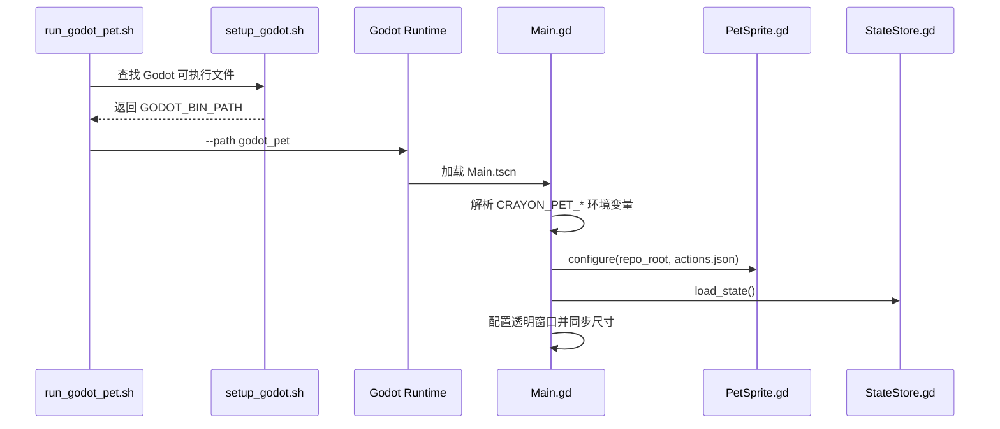
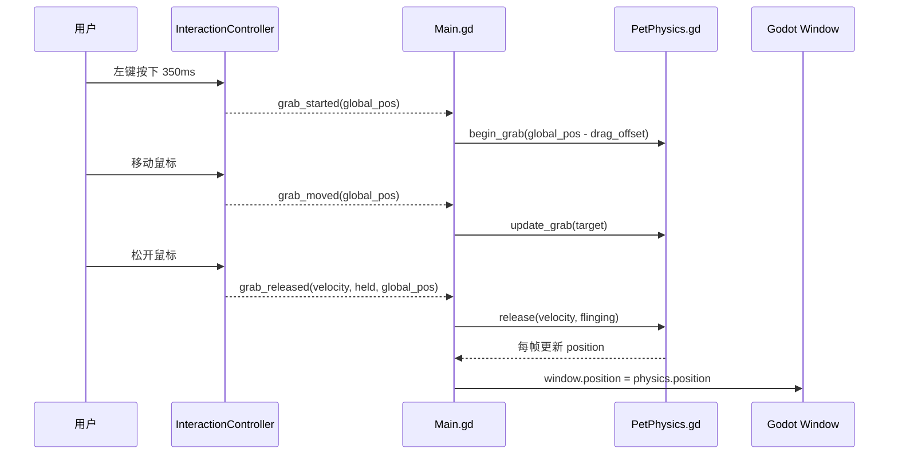
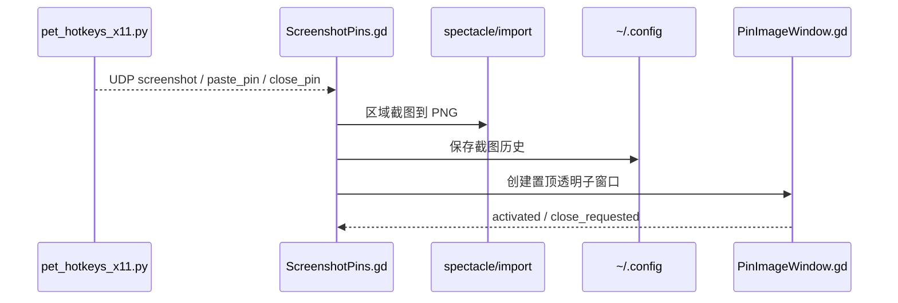

# 数据流

## 启动流程

## 交互到物理

长按抱起和释放甩飞的链路：

## 资源加载

`PetSprite.gd` 不直接扫描目录。它读取 `actions.json` 中的动作定义，并按顺序尝试加载：

1. `resource_hd/<relative_path>`
2. `resource/<relative_path>`

这样可以在不改 Godot 代码的情况下替换或重新生成高清帧。

## 截图贴图链路

贴图窗口本身由 Godot `Window` 实现。图片会按屏幕尺寸做最大尺寸限制，避免贴图大到超出屏幕。

## 状态数据

角色状态只有四个数值：

| 字段 | 含义 | 范围 |
| --- | --- | --- |
| `mood` | 心情 | 0-100 |
| `hunger` | 饥饿 | 0-100 |
| `energy` | 体力 | 0-100 |
| `affection` | 亲密度 | 0-100 |

`StateStore.gd` 每次应用变化后立即保存。行为模式不保存，每次启动默认回到安静模式。
